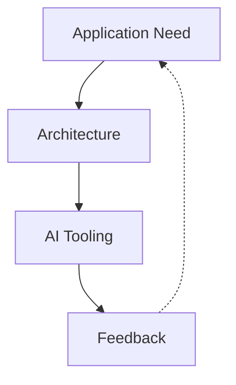
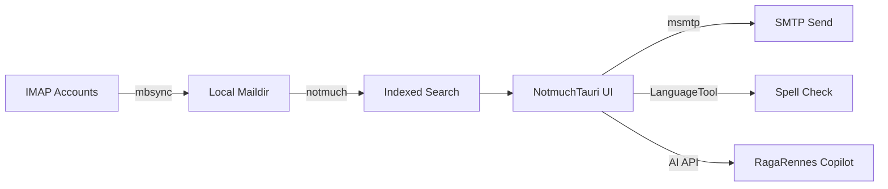
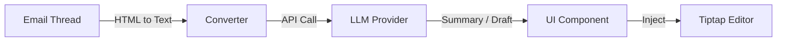
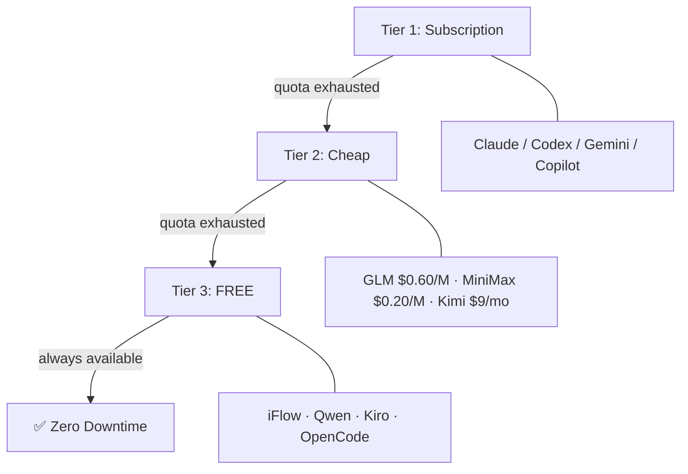
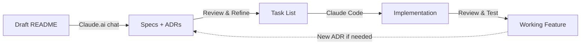

# NotmuchTauri

## Spec-Driven Development with Agentic AI

A return of experience: Claude Code + 9router + ILaas

<div class="pt-12">
  <span class="px-2 py-1 rounded cursor-pointer" hover="bg-white bg-opacity-10">
    DiverSE coffee
  </span>
</div>

---
layout: two-cols
---

# Agenda

1. **The Application Need** — Why NotmuchTauri?

2. **Architectural Choices** — Standing on the shoulders of giants

3. **AI Tooling Structure** — Claude Code + 9router + ILaas

4. **Return of Experience** — Code quality, model selection, Spec Driven Dev

5. **Open Research** -- Sharing Spec-Driven Datasets with the Community

::right::

<div class="mt-20 ml-8">



</div>

---
layout: section
---

# Part 1: The Application Need

## The Linux Philosophy Meets Modern UI

---

# Why Another Mail Client?

<v-clicks>

- **Problem**: Existing Linux mail clients lack modern UX and productivity features
- **Target users**: Power users managing multiple IMAP accounts with a **search-over-sort** philosophy
- **Key needs**:
  - Offline-first experience — full local sync
  - Blazing-fast search across hundreds of thousands of emails
  - Multiple account management from different providers
  - Productivity integrations (tasks, calendars, snippets)
  - Local AI copilot for email summarization and drafting
  - Sovereign data — no third-party leakage

</v-clicks>

<v-click>

> **NotmuchTauri** acts as a modern GUI coordinator for the best CLI email tools available in the Unix ecosystem.

</v-click>

---
layout: two-cols
---

# Philosophy & Use Cases

### Core Principles

- 🔍 **Search over sorting** — Archive everything, find instantly
- 📦 **Local backup & offline mode** — Full sync to local Maildir
- 🔔 **Push notifications** — Automated background sync via cron + IMAP IDLE
- ✉️ **Plain text & HTML** — Seamless multilingual support (EN/FR)
- ⚡ **Productivity integration** — Tasks, calendar, snippets
- 🤖 **AI copilot** — Summarize, draft, organize

::right::

<div class="ml-8 mt-8">

### The Power User Workflow



</div>

---

# Key Features at a Glance

<div class="grid grid-cols-2 gap-8">

<div>

### Email Management

- Read from multiple IMAP services (via `mbsync`)
- Compose HTML/Text emails
- Reply and Forward
- Fast querying and indexing (via `notmuch`)
- SMTP server selection per account
- Outbox folder management
- Drafts management
- Mail address completion from history
- LDAP integration for address completion

</div>

<div>

### Productivity & AI

- 🤖 LLM integration (OpenAI/Anthropic compatible)
- 📋 Task creation — Remember The Milk
- 📅 ICS event creation from emails
- 🔤 Spell check — LanguageTool (local)
- ⌨️ Customizable keyboard shortcuts
- 📝 Text snippets with `Ctrl+Space`
- 🔍 Notmuch query auto-completion
- 🔄 Edit as new email
- 📤 IMAP IDLE push notifications

</div>

</div>

---
layout: section
---

# Part 2: Architectural Choices

## Standing on the Shoulders of Giants

---

# Architecture: The Four Pillars

> Rather than reinventing the wheel and managing IMAP/SMTP protocols directly in Rust or JavaScript, NotmuchTauri acts as an **orchestrator** for the best open-source CLI tools.

<div class="grid grid-cols-2 gap-8 pt-4">

<div>

### 🔄 isync / mbsync
**The sync engine** — Reliably connects to IMAP accounts and downloads emails locally (Maildir format). Enables perfect offline-first experience.

### 🔍 Notmuch
**The core reactor** — Mail indexer and search engine based on Xapian. Find any message among hundreds of thousands in milliseconds using queries and tags.

</div>

<div>

### 📤 msmtp
**The SMTP client** — Minimalist and highly efficient. Generated messages are piped directly for dispatch.

### ✅ LanguageTool
**The grammar checker** — Runs locally. Analyzes drafts and suggests corrections without data leaking to third-party servers.

</div>

</div>


---

# Technology Stack

<div class="text-xs">

| Layer | Technology | Rationale |
|-------|-----------|------|
| Desktop framework | **Tauri (Rust)** | Lightweight, secure, small binary size |
| Frontend framework | **Vue 3** (`<script setup>`) | Reactive, composable, great DX |
| Styling | **Tailwind CSS** | Utility-first, rapid UI development |
| Rich text editor | **Tiptap** | Extensible, Markdown-compatible |
| Backend tools | **CLI orchestration** (mbsync, notmuch, msmtp, LanguageTool ) | Battle-tested Unix tools, no reinvention |
| **AI Layer** | OpenAI-compatible API, RagaRennes | Summarization & draft assistance |

</div>

<v-click>

> NotmuchTauri acts as an **orchestrator** — wrapping battle-tested Unix CLI tools in a modern Tauri/Vue desktop app.

</v-click>


---
layout: two-cols
---

# AI Integration in the Application

### RagaRennes: AI in Your Inbox

A collapsible side copilot embedded directly in the mail client:

- **Summarize endless threads**: The UI converts complex HTML threads → structured plain text → sends to AI for quick synthesis
- **Draft replies**: Give keywords ("Tell him the quote is validated and we start Monday") → AI generates formatted Markdown → one-click inject into Tiptap editor
- **Sovereign**: Any OpenAI-compatible API, data stays under control

::right::

<div class="ml-8 mt-4">

### Architecture



### Design Choices

- **Pluggable provider architecture**: Any OpenAI/Anthropic-compatible endpoint
- **Local-first**: LanguageTool runs locally
- **Async**: AI calls don't block the UI
- **Token-conscious**: HTML → plain text conversion before API call

</div>

---
layout: section
---

# Part 3: AI Tooling Structure

## Claude Code + 9router + ILaas

---


# The Development AI Stack

<div class="flex justify-center">


</div>

<div class="text-xs text-center opacity-70 mt-2">

**Claude Code CLI** → **9Router** (smart router: 3-tier fallback, token saver) → **ILaas / RagaRennes** (local LiteLLM gateway) → **Hosted models**

</div>

---
layout: two-cols
---

# 9Router: Smart AI Router

### What is it?

A **smart gateway** between your coding tools and 60+ AI providers.

### Key Features

<div class="text-sm">


- 🔄 **3-Tier Auto Fallback** {class="!text-sm"}: Subscription → Cheap → Free {class="!text-sm"}
- 📊 **Real-time quota tracking** with reset countdown
- 🎯 **OpenAI-compatible endpoint** at `localhost:20128`
- 🔧 **Format Translator**: OpenAI ↔ Anthropic ↔ Gemini
- 💰 **RTK Token Saver**: −20–40% input tokens (auto-compress `tool_result`)
- 🗜️ **Caveman Mode**: −65% output tokens (terse-style system prompt)
- ☁️ **Cloud sync + tunnel** — Cloudflare edge, 300+ locations
- 🔀 **Smart Combos** — chain providers with round-robin + fallback

</div>

::right::

<div class="ml-8">

### 3-Tier Fallback



### Setup

```bash
npm install -g 9router
# Point your tool to:
# http://localhost:20128/v1
```

**Benefit**: Never hit rate limits. Maximize subscription value before paying extra.

</div>

---
layout: two-cols
---

# ILaas: Local AI Gateway

### What is it?

<div class="text-sm">

A local **LiteLLM gateway and model hosting** that lets you run Claude Code, Codex CLI, and OpenCode with various model providers.

</div>

### Architecture

```
ILaaS
  ← LiteLLM /v1/chat/completions
    ← Codex Responses proxy
    ← Claude Messages proxy
    ← OpenCode (direct)
```


::right::

<div class="ml-8 text-sm">

### GLM-Supervisor / Gemma-Coder Harness {class="!text-sm"}

<div class="text-xs">

A **two-layer intelligence** approach:

1. **Native tier routing** inside Claude Code:
   - GLM 5.2 supervises → `opus` slot
   - Gemma 4 codes → `sonnet` slot
   - Gemma 4 (light) → `haiku` slot (trivial work)

2. **Subagent delegation**:
   - `code-pro` agent → Gemma 4
   - `ctx-pro` agent → Gemma 4 (verbose queries)

</div>

### Recommended Models

<div class="text-xs">

| Model | Provider | Use Case |
|-------|----------|----------|
| `GLM 5.2` | Scaleway | Supervisor · Planning · Debugging |
| `Gemma 4` | Univ. Strasbourg | Code implementation · Tool-calling |
| `Qwen` | Univ. Strasbourg | Code-agent tool use |


</div>

</div>

---

# Spec Driven Development Workflow

## The Approach

> Define **what** to build through detailed specifications, let AI figure out **how**.



<v-clicks>

1. **Specifications**: Written in Markdown, stored logically in `docs/specs/`
2. **Architecture Decision Records (ADRs)**: Capture key decisions with rationale in `docs/decisions/`
3. **Task breakdown**: Small, independent, well-scoped units of work in `docs/prompts/tasks/`
4. **System & workspace prompts**: Evolve with the project context in `docs/prompts/`

</v-clicks>

---

# Spec Driven: Project Structure

```
project-root/
├── docs/
│   ├── specs/
│   │   ├── 00-overview.md          # Vision, objectives, target users
│   │   ├── 01-requirements.md      # Functional & non-functional requirements
│   │   ├── 02-architecture.md      # System design, tech stack, models
│   │   ├── 03-data-models.md       # Database schemas, API contracts
│   │   ├── 04-ui-ux.md             # User flows, wireframes, design system
│   │   └── 05-features/            # Detailed feature specs
│   │       ├── auth.md
│   │       ├── dashboard.md
│   │       └── ...
│   ├── decisions/
│   │   ├── ADR-001-framework-choice.md
│   │   ├── ADR-002-state-management.md
│   │   └── README.md               # ADR index
│   └── prompts/
│       ├── system-prompt.md        # Claude Code behavior definition
│       ├── workspace-context.md     # Project context for AI
│       └── tasks/
│           ├── task-001.md
│           ├── task-002.md
│           └── task-template.md
```

---


# Claude Code Configuration: CLAUDE.md

### Defining Claude's Role

```markdown
## Who is Claude Code?

A senior engineer who follows Git Flow
strategy and proposes performant,
secure, and clean solutions.

He must:
- Create a feature branch for new features
- Create a fix branch for bug fixes
- Create a doc branch for Markdown changes
- Always plan tasks and ask for approval
  before coding
- Follow conventional commit rules
- No unnecessary output tokens —
  straight to the point
```

https://github.com/notmuchtauri/notmuchtauri/blob/main/CLAUDE.md

---
layout: two-cols
---

# Key Principles


<div class="text-sm">

<v-clicks>


- 📋 **Plan first, code second**: Claude must propose a plan and get approval before writing code
- 🌿 **Git Flow enforcement**: Explicit branch naming conventions in system prompt
- 🧪 **Tests before code**: Suggest adding tests before implementation
- 📝 **ADR-driven**: New ADR when architectural decisions arise
- 🔄 **Iterative refinement**: System prompts evolve as gaps are discovered
- ⚠️ **Human review is mandatory**: Claude doesn't always get it right

</v-clicks>


</div>

::right::

### Initialization Flow

<div class="flex justify-center">


</div>

---
layout: section
---

# Part 4: Return of Experience

## Code Quality, Model Selection & Lessons Learned

---

# Code Quality Assessment

<div class="grid grid-cols-2 gap-8">

<div>

### ✅ What Worked Well


<div class="text-sm">

<v-clicks>


- **Clean, readable code**: Vue 3 `<script setup>` components well-structured
- **Complex components handled well**: Recursive reply trees, text overlays on drafts
- **Consistent patterns**: Claude maintained coding conventions across the project
- **Test scaffolding**: Useful initial test generation (but requires review!)
- **Rapid prototyping**: From spec to working code in minutes
- **Learning**: Discovered new concepts (e.g., Breadth-First Search algorithms)
- **Documentation**: ADRs serve as living architectural documentation

</v-clicks>

</div>
</div>

<div>

### ⚠️ Challenges Encountered

<div class="text-sm">

<v-clicks>

- **CORS blind spot**: Claude assured no CORS issues → turned out wrong
- **Tests can be misleading**: Tests passed but had `fetch` call failures polluting CI output
- **Context management**: Context size always too small
- **Git Flow compliance**: Initially didn't follow conventions — needed explicit, precise instructions

</v-clicks>
</div>

</div>

</div>

---
layout: section
---

# Security: Claude's Blind Spot

## CLI Injection & Unsafe Defaults

---

# The Core Problem: CLI Injection

<div class="grid grid-cols-2 gap-6">

<div>

### ⚠️ What Claude Generates by Default


<div class="text-sm">
<v-clicks>


- NotmuchTauri orchestrates CLI tools: `mbsync`, `notmuch`, `msmtp`, `LanguageTool`
- Claude **pipes user input directly** into command arguments
- No sanitization, no validation, no escaping
- This is Claude's **default pattern** — it's what it learned from training data

</v-clicks>

</div>
<v-click>

```rust
// ❌ What Claude produces by default
let output = Command::new("notmuch")
    .arg("search")
    .arg(&user_query)  // Raw user input!
    .output()?;
```

</v-click>


<div class="text-sm">
<v-click>

- `user_query` comes directly from the search bar
- An email subject containing `; rm -rf /` or `--arg=malicious` would be passed as-is
- Claude sees nothing wrong with this code

</v-click>
</div>
</div>

<div>

### 🔐 What Should Be Done

<div class="text-xs">

<v-clicks>

- **Allowlist characters**: Reject anything outside `[a-zA-Z0-9 _@.-]`
- **Use `--` separator** where the CLI supports it (stops option parsing)
- **Never use `shell: true`** — always pass args as an array
- **Validate at the boundary**: Sanitize before the command call, not after
- **Cap input length**: Prevent buffer-style attacks

</v-clicks>
</div>
<div class="text-sm">

<v-click>

```rust
// ✅ What should be done
fn sanitize_query(input: &str) 
    -> Result<String, &'static str> 
{
    if input.len() > 256 {
        return Err("Query too long");
    }
    if !input.chars().all(|c| 
        c.is_alphanumeric() 
        || c.is_whitespace() 
        || "@.-_".contains(c) 
    ) {
        return Err("Invalid characters in query");
    }
    Ok(input.to_string())
}

// Usage
let safe = sanitize_query(&user_query)?;
let output = Command::new("notmuch")
    .arg("search")
    .arg("--")    // Stop option parsing
    .arg(&safe)   // Sanitized input
    .output()?;
```

</v-click>
</div>
</div>

</div>

---

# Attack Vectors in NotmuchTauri

<div class="grid grid-cols-2 gap-6">

<div>

### 🎯 Entry Points for Injection

<div class="text-xs">


<v-clicks>

| Source | Risk | Example |
|--------|------|---------|
| **Search bar** | `notmuch` query injection | `tag:inbox; mbsync --delete` |
| **Email subject** | Passed to `notmuch` for threading | Subject: `"; rm -rf ~/Mail"` |
| **Email tags** | Used in `notmuch` operations | `+important --remove-all` |
| **SMTP params** | Passed to `msmtp` | `--config=/etc/passwd` |
| **LDAP query** | Address completion injection | `*)(uid=*` |
| **File paths** | Maildir paths from IMAP | `../../etc/passwd` |

</v-clicks>
</div>
</div>

<div>

### 💥 Realistic Attack Scenarios

<div class="text-sm">
<v-clicks>

1. **Malicious email subject**:
   - Attacker sends email with subject: `inbox"; notmuch tag -inbox *"`
   - If passed unsanitized → **all emails untagged**

2. **Search bar injection**:
   - User types: `test; msmtp --sendmail=/malicious_script.sh`
   - If `shell: true` was used → **arbitrary command execution**

3. **Tag manipulation**:
   - Email with crafted tag: `+important -- remove-all +spam`
   - Passed to `notmuch tag` → **all emails marked as spam**

4. **Path traversal**:
   - Crafted Maildir path: `../../../etc/`
   - Passed to file operations → **arbitrary file access**

</v-clicks>

</div>
</div>

</div>

<v-click>

> ⚠️ Claude considers none of these when generating code. It produces the "happy path" — the most common pattern from its training data, which almost never includes security hardening.

</v-click>

---

# Claude's Security Blind Spots

<div class="grid grid-cols-2 gap-6">

<div>

### 🤖 Why Claude Misses This

<div class="text-sm">
<v-clicks>

- **Training bias**: Most open-source code is **not security-hardened**
- Claude learns from what's most common, not what's safest
- Security best practices are **exceptions**, not the norm
- Claude has no concept of the **threat model** for your specific app
- "It works" ≠ "It's secure" — Claude optimizes for the former
- Even when asked to "add security", Claude adds **superficial checks**:
  - Basic `if input.contains(";")` checks (incomplete)
  - Regex that misses Unicode bypasses
  - Forgets to validate ALL entry points — only the one mentioned

</v-clicks>
</div>
</div>

<div>

### 📊 Pattern Observed

<v-clicks>

```text
Interaction with Claude on security:

[Ask] "Implement notmuch search"
   → Generates code with raw user input

[Ask] "Is this secure?"
   → "Yes, Rust's Command API prevents 
      shell injection by design"
   → (True for shell, FALSE for arg injection!)

[Ask] "What about argument injection?"
   → "You're right, let me add validation"
   → Adds incomplete character check

[Ask] "Is it complete now?"
   → "Yes, this covers all cases"
   → (Still missing length limits, 
      Unicode bypasses, -- separator)
```

</v-clicks>

</div>

</div>

<v-click>

> 🔑 **Key lesson**: Claude **will not flag security issues on its own**. You must explicitly audit every CLI interaction, every external command, every user-facing取得 input path. Claude's confidence in its own code is **not** a security guarantee.

</v-click>

---

# Security Checklist: What to Audit Manually

<div class="grid grid-cols-2 gap-6">

<div>

### 🔍 Every CLI Interaction

<div class="text-sm">

<v-clicks>

- [ ] `mbsync` — account name, config path
- [ ] `notmuch` — search query, tags, message IDs
- [ ] `msmtp` — recipient, subject, config path
- [ ] `LanguageTool` — text input, port number
- [ ] Any `Command::new(...)` call

</v-clicks>

</div>

### 🔍 Input Validation


<div class="text-sm">


<v-clicks>

- [ ] Search bar input
- [ ] Email subject / body (used in CLI ops)
- [ ] Tag names (user-created)
- [ ] Account configuration fields
- [ ] File paths from external sources

</v-clicks>
</div>
</div>

<div>

### 🛡️ Defensive Layers to Add

<div class="text-sm">

<v-clicks>

1. **Input sanitization function** — reusable, tested
2. **Character allowlist** — not blocklist
3. **Length limits** — prevent buffer attacks
4. **`--` separator** — stop option parsing
5. **No `shell: true`** — ever
6. **Sandboxed execution** — restrict filesystem access
7. **Audit log** — record all CLI invocations
8. **Unit tests for edge cases**:
   - Empty input
   - Unicode characters
   - Shell metacharacters
   - Long strings
   - Null bytes

</v-clicks>

</div>
</div>

</div>

<v-click>

> 📌 **Bottom line**: In a CLI-orchestrated application like NotmuchTauri, **every user input that reaches a CLI tool is a potential attack vector**. Claude will not catch these — manual security review is mandatory.

</v-click>

---
layout: center
class: text-center
---

# The Takeaway

<div class="pt-8">

<v-clicks>

### Claude could be a productive coder

### Claude is **not** a security engineer

### CLI injection is Claude's #1 blind spot in orchestrator architectures

### **Manual security review of every CLI interaction is non-negotiable**

</v-clicks>

</div>


---

# Model Selection: Matching Models to Tasks

<div class="pt-2">

| Task Type | Recommended Model | Rationale | Tier |
|-----------|-------------------|-----------|------|
| **Planning & Architecture** | Claude Opus / GLM 5.2 (supervisor) | Deep reasoning, system design | Subscription / Ilaas |
| **Complex Debugging** | Claude Opus / GLM 5.2 | Multi-step analysis, root cause | Subscription / /Ilaas |
| **Code Implementation** | Claude Sonnet / Gemma 4 31 | Fast, efficient execution | Subscription / Cheap |
| **Trivial Tasks** |Gemma 4 31 | Cost-effective for simple work | Cheap / Free |
| **Refactoring** | GLM 5.2  | Good balance of speed and quality | Subscription/Ilaas |
| **Documentation** | Any model (Gemma, Qwen) | Low complexity, high token output | Free |
| **Tool-calling** | `qwen-3.6-35b-instruct` | Verified tool-calling support | Free / Cheap |

</div>

<v-click>

> 💡 **Key insight**: Using ILaas/9router tier routing, you can **automatically delegate** tasks to the most cost-effective model without manual switching. The GLM-supervisor/DeepSeek-coder harness handles this natively inside Claude Code.

</v-click>


---
layout: section
---

# Part 4b: The Hard Truth

## When Spec Driven Dev Breaks Down

---

# Spec Driven Development: The Reality

<div class="grid grid-cols-2 gap-8">

<div>

### 📋 What Was Planned

<v-clicks>

- Detailed specs written upfront
- ADRs capturing every decision
- Task breakdown into small units
- Claude Code follows the plan
- Human reviews, AI implements
- Systematic, reproducible workflow

</v-clicks>

</div>

<div>

### 🔴 What Actually Happened

<v-clicks>

- Specs quickly became **outdated** as the code evolved
- Claude **ignored spec documents** after a few iterations
- Tasks grew beyond their original scope mid-session
- **Live coding took over** — specs abandoned
- Context window filled up → Claude lost track of rules
- Ended up in **reactive mode**: fix this, now fix that

</v-clicks>

</div>

</div>

<v-click>

> ⚠️ **Honest assessment**: Despite careful spec writing, the workflow naturally drifted toward **conversational live coding**. The specs became reference documents rather than driving documents.

</v-click>

---

# Claude Forgets the Rules

### The CLAUDE.md Amnesia Problem

<div class="text-xs">

<v-clicks>

- **CLAUDE.md rules are loaded once** at session start
- After a few exchanges, Claude **stops consulting them**
- Coding conventions drift:
  - Git Flow branch naming forgotten mid-session
  - Conventional commits abandoned after task 3
  - Error handling patterns inconsistent across files
  - TypeScript types become `any` when Claude gets "tired"
- **Re-reminding is necessary** but breaks flow
- Each reminder **consumes tokens** without guaranteeing retention
- The longer the session, the worse the drift

</v-clicks>

</div>

<v-click>

```text
Session timeline:
[start] ✅✅✅ Follows CLAUDE.md perfectly
[+1h]   ✅✅⚠️  Starts drifting on minor rules
[+2h]   ✅⚠️⚠️  Forgets Git Flow, uses generic commits
[+3h]   ⚠️⚠️❌  Live coding mode — specs ignored
[+4h]   ❌❌❌  Full live coding, CLAUDE.md forgotten
```

</v-click>

---
layout: two-cols
---

# Why Spec Driven Failed

### Root Causes

<v-clicks>

1. **Context window degradation**: Claude's attention to specs fades as the conversation grows
2. **Spec maintenance overhead**: Keeping specs in sync with code changes was **more work than the coding itself**
3. **Iteration speed mismatch**: Live coding is simply **faster** for most tasks
4. **Ambiguity in specs**: Specs can't anticipate every edge case — Claude fills gaps with its own assumptions
5. **No enforcement mechanism**: CLAUDE.md is a **suggestion**, not a constraint
6. **Scope creep in tasks**: What starts as "implement feature X" becomes "also fix Y, refactor Z"
7. **Session reset cost**: `/clear` loses context but keeping it loses rules — **no good option**

</v-clicks>

::right::

<div class="ml-8">

### The Failure Pattern

<div class="flex justify-center">


</div>


</div>>

---

# Live Coding: The Inevitable Outcome

<div class="grid grid-cols-2 gap-8">

<div>

### How It Actually Goes

<v-clicks>

1. Start with a well-written task spec
2. Claude implements the first version
3. **Edge case discovered** → not in spec
4. "Just fix it here" → live coding begins
5. Another issue → another quick fix
6. Spec is now 3 changes behind
7. Give up updating the spec
8. **Full conversational live coding** for the rest of the session
9. CLAUDE.md rules? Long forgotten

</v-clicks>

</div>

<div>

### Why It's Not All Bad

<v-clicks>

- Live coding with Claude is still **very productive**
- Faster iteration than spec → review → implement → review
- Good for **exploratory work** and prototyping
- Natural for **debugging sessions**
- Works well for **small, well-scoped tasks**

</v-clicks>

<v-click>

> 📌 The problem isn't live coding — it's the **false expectation** that Spec Driven Dev would prevent it.

</v-click>

</div>

</div>

---

# What Would Make It Work?

### Potential Fixes (Untested)

<div class="grid grid-cols-2 gap-8">

<div>

<v-clicks>

- **Automatic spec re-injection**: Re-load CLAUDE.md rules every N messages
- **Pre-commit hooks**: Block commits that violate conventions (husky + lint-staged)
- **Shorter sessions**: Reset context every 45–60 min, not every 5 hours
- **Spec as living code**: Generate specs FROM code changes, not the reverse
- **Mandatory review checkpoints**: Force a pause every 3 tasks to re-align with specs
- **Strict task scoping**: One task = one file = one commit, no exceptions

</v-clicks>

</div>

<div>

<v-clicks>

- **CLAUDE.md modular**: Split rules into per-file / per-directory configs
- **Linting as enforcement**: eslint, rustfmt, clippy as the real guardrails
- **Spec diff alerts**: Tooling to detect when code diverges from spec
- **Token budget per task**: Hard limit to prevent scope creep
- **Hybrid approach**: Specs for architecture, live coding for implementation

</v-clicks>

<v-click>

> 🔑 **Realistic takeaway**: Spec Driven Dev with current AI tools works best as a **starting framework**, not a strict process. Expect it to degrade into live coding — and plan for that.

</v-click>

</div>

</div>

---

### Revised Assessment: Spec Driven Dev

<div class="pt-3">

| Aspect | Expected | Actual |
|--------|----------|--------|
| **Spec adherence** | Claude follows specs throughout session | Forgotten after ~1h of conversation |
| **CLAUDE.md retention** | Rules applied consistently | Rules drift, types loosen, conventions abandoned |
| **Task scoping** | Small, well-scoped tasks | Scope creep → live coding |
| **Spec maintenance** | Specs updated as code evolves | Specs abandoned — too much overhead |
| **Code consistency** | Uniform patterns across codebase | Inconsistent after context degradation |
| **Workflow discipline** | Spec → implement → review → commit | Quickly becomes: chat → code → fix → commit |
| **Reproducibility** | Anyone can follow the same workflow | Each session is unique, ad-hoc |
| **Time efficiency** | Specs save time by preventing rework | Spec writing + maintenance ≈ time saved |

</div>

<v-click>

> 🧭 **Final verdict**: Spec Driven Dev is a **valuable starting point** — it sets the architectural direction. But expecting Claude to maintain discipline throughout a session is unrealistic with current tooling. **Plan for degradation, enforce with tooling (linters, hooks), and accept that live coding is the natural endpoint.**

</v-click>


---
layout: section
---

# Part 5: Open Research

## Sharing Spec-Driven Datasets with the Community

---

# The Problem: No Common Ground

<div class="grid grid-cols-2 gap-8">

<div>

### 🤔 Current State of Spec-Driven Dev

<v-clicks>

- Every developer **invents their own structure**
- No standard for organizing specs, ADRs, prompts
- No **reproducible datasets** to compare approaches
- Tutorials exist but are **non-reproducible** — no shared specs, no shared evaluation
- Impossible to answer: *"Is my CLAUDE.md structure good?"*
- No way to benchmark: *"Does GLM 5.2 follow specs better than Gemma 4?"*

</v-clicks>

</div>

<div>

### 📊 What's Missing

<v-clicks>

- **Shared spec datasets** — like ImageNet for vision, but for spec-driven coding
- **Session transcripts** — real conversations, real degradation patterns
- **Evaluation rubrics** — objective criteria for code quality, spec adherence, security
- **Multi-model comparisons** — same specs, different models, measurable results
- **Failure cases** — documented examples of where AI drifts, forgets, hallucinates

</v-clicks>

</div>

</div>

<v-click>

> 💡 We need the equivalent of **standard benchmarks** for agentic AI coding — not toy apps, but **real applications** with real complexity.

</v-click>

---

# Proposal: NotmuchTauri Spec Dataset

<div class="pt-2">

> An open, reproducible dataset built around a **real desktop email client** — specs, ADRs, prompts, tasks, session logs, and evaluation rubrics.

</div>

<div class="grid grid-cols-2 gap-8 pt-4">

<div>

### Why NotmuchTauri?

<v-clicks>

- ✅ **Real complexity**: CLI orchestration, IMAP, rich text, AI copilot, security challenges
- ✅ **Existing artifacts**: Specs, ADRs, CLAUDE.md, task breakdowns already produced
- ✅ **Documented failures**: CORS blind spot, CLI injection, context degradation
- ✅ **Multi-model history**: GLM 5.2, Gemma 4, Qwen — real comparison data
- ✅ **Honest retex**: Both successes and failures are documented

</v-clicks>

</div>

<div>

### Dataset Structure

```
dataset/
├── specs/           # Frozen specifications
├── decisions/       # ADRs (including failures)
├── prompts/         # CLAUDE.md, system prompts
├── tasks/           # Independent, reproducible
├── sessions/        # Logs per model per task
│   ├── glm-5.2/
│   ├── gemma-4/
│   └── qwen/
├── evaluations/     # Rubrics & results
└── tools/           # Replay & compare scripts
```

</div>

</div>

---

# Research Questions

<div class="grid grid-cols-2 gap-8">

<div>

### 🔬 Model Comparison

<v-clicks>

- Which model **follows specs most faithfully** over a long session?
- Does a **supervisor/coder harness** (GLM + Gemma) outperform a single model?
- How does **context degradation** compare across models?
- At what point does each model **stop consulting CLAUDE.md**?
- Which model produces the **most secure code** by default?

</v-clicks>

</div>

<div>

### 📐 Methodology Comparison

<v-clicks>

- **Spec-driven vs live coding**: same feature, two approaches — measure quality, cost, time
- **CLAUDE.md structures**: short vs detailed, modular vs monolithic — which is retained longest?
- **Task granularity**: small tasks vs large tasks — impact on spec adherence?
- **Routing impact**: does 9router tier routing change code quality?
- **Security default**: which model adds sanitization without being asked?

</v-clicks>

</div>

</div>

<v-click>

> 🎯 **Goal**: Enable anyone to `replay-task.sh task-002 --model qwen` and get a **measurable, comparable result**.

</v-click>

---

# Community Contribution Vision

<div class="grid grid-cols-2 gap-8">

<div>

### 🌍 Open Dataset

<v-clicks>

- **License**: MIT for dataset, code stays owner's choice
- **GitHub repository** — public, contribution-friendly
- **Format standard**: reusable for other projects beyond NotmuchTauri
- **Other apps welcome**: the more real apps, the better the benchmarks
- **Session submissions**: teams add their own runs with different models / tools

</v-clicks>

</div>

<div>

### 🤝 How to Contribute

<v-clicks>

1. **Pick a task** from the dataset
2. **Run it** with your model / tool / config
3. **Submit** the session log + output code
4. **Evaluate** using the shared rubrics
5. **Compare** with existing results

</v-clicks>

<v-click>

```bash
# Envisioned workflow
./tools/replay-task.sh tasks/task-003 \
  --model qwen-3.6-35b \
  --router 9router \
  --output sessions/qwen/task-003/

./tools/evaluate.py sessions/qwen/task-003/ \
  --rubric evaluations/rubric-code-quality.md
```

</v-click>

</div>

</div>

---

# Expected Outcomes

<div class="pt-2">

| Outcome | Benefit |
|---------|---------|
| **Benchmark table** | Model X vs Model Y on the same real-world specs |
| **Degradation patterns** | When and why AI stops following rules — data, not anecdotes |
| **Best practices** | Which CLAUDE.md structures work best — empirically validated |
| **Security audit dataset** | Which models produce secure code by default |
| **Cost/quality tradeoffs** | Is a $0.60/M model really 10× worse than a $15/M model? |
| **Failure taxonomy** | Categorized failure modes (CORS, injection, spec drift, type loosening) |
| **Reproducibility standard** | A format others can adopt for their own projects |

</div>

<v-click>

<div class="pt-6 text-center">

> 📌 **The community doesn't need more "I built an app with AI" posts.**
> **It needs reproducible datasets to compare approaches scientifically.**

</div>

</v-click>

---
layout: center
class: text-center
---

# Call to Action

<div class="pt-8">

<v-clicks>

### NotmuchTauri spec dataset will be open-sourced

### We invite other teams to contribute their own sessions

### Let's build a shared benchmark for spec-driven AI development

</v-clicks>

</div>

<div class="pt-8 text-sm opacity-70">

🔗 **NotmuchTauri**: [notmuchtauri.github.io](https://notmuchtauri.github.io/)

📦 **Dataset repo**: *coming soon* — stay tuned

</div>


---
layout: center
class: text-center
---

# Thank You

## Questions & Discussion

<div class="pt-8 text-sm">

🔗 **NotmuchTauri**: [notmuchtauri.github.io](https://notmuchtauri.github.io/)

📖 **Spec Driven Dev article**: [jeremielitzler.fr](https://jeremielitzler.fr/post/2026-03/developpement-par-specifications-avec-claude-code/)

🔧 **9Router**: [github.com/decolua/9router](https://github.com/decolua/9router)

🔧 **ILaas**: [github.com/jeffwitz/ILaas-agent](https://github.com/jeffwitz/ILaas-agent)

</div>

<div class="pt-4 text-xs opacity-50">

Presentation built with Slidev — slides written in Markdown

</div>

<!-- À coller à la toute fin du fichier, après la dernière slide -->
<style>
/* --- Base font sizes --- */
h1 { font-size: 1.3rem !important; }
h2 { font-size: 1.3rem !important; }
h3 { font-size: 1.15rem !important; }
h4 { font-size: 0.95rem !important; }

/* --- Body text --- */
p, li { font-size: 0.85rem; line-height: 1.3; }
ul, ol { font-size: 0.88rem; }

/* --- Code blocks --- */
pre, code {
  font-size: 0.8rem !important;
  line-height: 1.35;
}

/* --- Tables --- */
table { font-size: 0.82rem; }
th, td { padding: 0.35rem 0.6rem; }

/* --- Blockquotes --- */
blockquote { font-size: 0.9rem; }

/* --- Mermaid diagrams --- */
.mermaid { font-size: 0.5rem; }
</style>